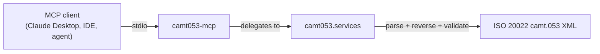

# camt053-mcp: An MCP Server for ISO 20022 Bank Statements

<p align="center">
  
</p>

[![PyPI Version][pypi-badge]][07]
[![Python Versions][python-versions-badge]][07]
[![License][license-badge]][01]
[![Tests][tests-badge]][tests-url]
[![Quality][quality-badge]][quality-url]
[![Documentation][docs-badge]][docs-url]

**A [Model Context Protocol][mcp] server that exposes the [`camt053`][core]
ISO 20022 Bank Statement library as tools for AI agents and assistants** —
discover message types and return reasons, inspect input schemas, validate
records and financial identifiers, parse incoming statements, and generate
validated reversing-entry XML, all from your favourite MCP client.

> **Latest release: v0.0.4** — nine MCP tools over stdio, all backed by the
> shared `camt053.services` layer, for Python 3.10+.
> [See what's new →][release-004]

## Contents

- [Overview](#overview)
- [Install](#install)
- [Quick Start](#quick-start)
- [Tools](#tools)
- [Prompts](#prompts)
- [Resources](#resources)
- [Using the tools](#using-the-tools)
- [Development](#development)
- [License](#license)
- [Contributing](#contributing)
- [Acknowledgements](#acknowledgements)

## Overview

The [Model Context Protocol][mcp] (MCP) is an open standard that lets AI agents
and assistants discover and call external tools in a uniform way. **camt053-mcp**
is an MCP server that turns the [`camt053`][core] library into a set of
first-class agent tools, so an assistant can read and reverse **ISO 20022
`camt.05x` cash-management messages** — the standardised bank-to-customer
account reports, statements, and debit/credit notifications — directly from a
conversation.

The headline capability is the one-shot reversing-entry workflow: read an
incoming camt.053 statement, find the entries carrying a return reason code
(e.g. AC04 Closed Account), and emit a validated reversing entry.

Every tool is a thin, typed wrapper over `camt053.services` — the single shared
facade also used by the CLI and REST API — so all interfaces behave identically.
Tools return JSON-serialisable data; on an error they return an
`{"error": ...}` payload rather than raising.

- **Website:** <https://camt053.com>
- **Source code:** <https://github.com/sebastienrousseau/camt053-mcp>
- **Bug reports:** <https://github.com/sebastienrousseau/camt053-mcp/issues>

This package is part of the **camt053 suite** — a set of independently
installable packages that share the `camt053.services` layer:

- [`camt053`][core] — the core library (CLI + REST API)
- `camt053-mcp` — this package, the **Model Context Protocol** server
- [`camt053-lsp`][lsp] — the **Language Server Protocol** server for editors



## Install

**camt053-mcp** runs on macOS, Linux, and Windows and requires **Python 3.10+**
and **pip**. It pulls in the core `camt053` library and the MCP SDK
automatically.

```sh
python -m pip install camt053-mcp
```

> **Note:** while the core `camt053` library is not yet on PyPI, install it from
> source first:
>
> ```sh
> python -m pip install "git+https://github.com/sebastienrousseau/camt053.git"
> python -m pip install camt053-mcp
> ```

<details>
<summary>Using an isolated virtual environment (recommended)</summary>

```sh
python -m venv venv
source venv/bin/activate        # macOS/Linux
venv\Scripts\activate           # Windows
python -m pip install -U camt053-mcp
```
</details>

## Quick Start

Launch the server over stdio (the FastMCP default transport):

```sh
camt053-mcp
```

Register it with any MCP client (e.g. Claude Desktop) by adding it to the
client's configuration:

```json
{
  "mcpServers": {
    "camt053": { "command": "camt053-mcp" }
  }
}
```

The agent can then call the tools below to parse incoming statements and
generate validated reversing entries on demand.

## Tools

All tools delegate to the shared `camt053.services` layer, so they behave
identically to the CLI and REST API.

| Tool | Purpose |
|------|---------|
| `list_message_types` | List the 3 supported camt.05x message types |
| `list_return_reasons` | List the ISO external return reason codes |
| `get_required_fields` | Required input fields for a message type |
| `get_input_schema` | Full input JSON Schema for a message type |
| `validate_records` | Validate flat records against a message type |
| `validate_identifier` | Validate an IBAN, BIC, or LEI |
| `validate_statement` | Validate a statement against its XSD and detect its type |
| `parse_statement` | Parse an incoming camt.05x statement into data |
| `list_entries` | List every entry across all statements (paginated) |
| `filter_entries` | Return entries carrying a return reason code (paginated) |
| `generate_reversal` | Generate a validated reversing-entry XML document |

### Pagination

`list_entries` and `filter_entries` accept optional `offset` (default `0`) and
`limit` (default `None`) parameters. When `limit` is omitted they return the
full list, exactly as before. When `limit` is given they return a paginated
envelope instead:

```json
{"total": 42, "offset": 10, "limit": 5, "entries": [/* ... */]}
```

A negative `offset` or `limit` returns an `{"error": ...}` payload, consistent
with the rest of the server's error convention.

## Prompts

| Prompt | Purpose |
|--------|---------|
| `reversal_preview` | Guide an agent through a safe, confirm-before-generate reversal workflow |

`reversal_preview` takes an optional `reason_code` (default `"AC04"`) and
returns a four-step message template: parse the statement, preview the matching
entries with `filter_entries`, confirm with the operator, then call
`generate_reversal`.

## Resources

Resources give an agent read-only reference context it can load without
calling a tool. Each resource returns a JSON payload.

| Resource URI | Contents |
|--------------|----------|
| `camt053://return-reasons` | The ISO external return-reason catalog — a list of `{"code", "name"}` |
| `camt053://message-types` | The supported camt.05x message types — a list of `{"message_type", "name"}` |

Both back onto the shared `camt053.services` layer, so they stay in sync with
the equivalent `list_return_reasons` / `list_message_types` tools. On an error
they return a serialised `{"error": ...}` payload.

> **Note:** A `validate_statement` MCP tool is **deferred** to a later release —
> it depends on a core `camt053.services.validate_statement` API that ships with
> `camt053` 0.0.2.

## Using the tools

You can invoke the tools in-process — without a transport — straight through the
FastMCP instance. This mirrors what an agent receives over stdio. The runnable
version of this snippet lives in [`examples/mcp_tools.py`](examples/mcp_tools.py).

```python
import asyncio

from camt053_mcp.server import server

# A complete camt.053 statement with one entry returned AC04 (Closed Account).
statement_xml = """<?xml version="1.0" encoding="UTF-8"?>
<Document xmlns="urn:iso:std:iso:20022:tech:xsd:camt.053.001.14">
  <BkToCstmrStmt>
    <GrpHdr><MsgId>STMT-MSG-0001</MsgId><CreDtTm>2026-06-15T08:00:00</CreDtTm></GrpHdr>
    <Stmt>
      <Id>STMT-0001</Id><CreDtTm>2026-06-15T08:00:00</CreDtTm>
      <Acct><Id><IBAN>GB29NWBK60161331926819</IBAN></Id><Ccy>EUR</Ccy></Acct>
      <Bal><Tp><CdOrPrtry><Cd>CLBD</Cd></CdOrPrtry></Tp>
        <Amt Ccy="EUR">10000.00</Amt><CdtDbtInd>CRDT</CdtDbtInd>
        <Dt><Dt>2026-06-15</Dt></Dt></Bal>
      <Ntry>
        <NtryRef>NTRY-0001</NtryRef>
        <Amt Ccy="EUR">1500.00</Amt><CdtDbtInd>CRDT</CdtDbtInd>
        <Sts><Cd>BOOK</Cd></Sts>
        <NtryDtls><TxDtls>
          <RtrInf><Rsn><Cd>AC04</Cd></Rsn></RtrInf>
        </TxDtls></NtryDtls>
      </Ntry>
    </Stmt>
  </BkToCstmrStmt>
</Document>"""


async def main() -> None:
    async def call(name, args):
        result = await server.call_tool(name, args)
        content = result[0] if isinstance(result, tuple) else result
        return content[0].text if content else ""

    # Validate an identifier.
    print(await call("validate_identifier",
                     {"kind": "bic", "value": "NWBKGB2LXXX"}))
    # -> {"kind": "bic", "value": "NWBKGB2LXXX", "valid": true}

    # Page through the matching entries (paginated envelope).
    print(await call("filter_entries",
                     {"xml": statement_xml, "reason_code": "AC04",
                      "offset": 0, "limit": 5}))
    # -> {"total": 1, "offset": 0, "limit": 5, "entries": [...]}

    # Generate a validated reversing-entry document for the AC04 entries.
    xml = await call("generate_reversal",
                     {"xml": statement_xml, "reason_code": "AC04"})
    print(xml[:46])  # -> <?xml version="1.0" encoding="UTF-8"?> ...


asyncio.run(main())
```

Run it directly:

```sh
python examples/mcp_tools.py
```

## Development

**camt053-mcp** uses [Poetry](https://python-poetry.org/) and
[mise](https://mise.jdx.dev/).

```bash
git clone https://github.com/sebastienrousseau/camt053-mcp.git && cd camt053-mcp
mise install
poetry install
poetry shell
```

> This package depends on the core `camt053` library. Until it is on PyPI,
> install it from source first:
> `pip install "git+https://github.com/sebastienrousseau/camt053.git"`.

A `Makefile` orchestrates the quality gates (kept in lockstep with CI):

```bash
make check        # all gates (REQUIRED before commit)
make test         # pytest
make lint         # ruff + black
make type-check   # mypy --strict
```

## License

Licensed under the [Apache License, Version 2.0][01]. Any contribution submitted
for inclusion shall be licensed as above, without additional terms.

## Contributing

Contributions are welcome — see the [contributing instructions][04]. Thanks to
all [contributors][05].

## Acknowledgements

Built on the [`camt053`][core] ISO 20022 Bank Statement library and the
[Model Context Protocol][mcp] Python SDK.

[01]: https://opensource.org/license/apache-2-0/
[04]: https://github.com/sebastienrousseau/camt053-mcp/blob/main/CONTRIBUTING.md
[05]: https://github.com/sebastienrousseau/camt053-mcp/graphs/contributors
[07]: https://pypi.org/project/camt053-mcp/
[core]: https://github.com/sebastienrousseau/camt053
[lsp]: https://github.com/sebastienrousseau/camt053-lsp
[mcp]: https://modelcontextprotocol.io
[release-004]: https://github.com/sebastienrousseau/camt053-mcp/releases/tag/v0.0.4
[docs-badge]: https://img.shields.io/badge/Docs-camt053.com-blue?style=for-the-badge
[docs-url]: https://camt053.com/
[license-badge]: https://img.shields.io/pypi/l/camt053-mcp?style=for-the-badge
[pypi-badge]: https://img.shields.io/pypi/v/camt053-mcp?style=for-the-badge
[python-versions-badge]: https://img.shields.io/pypi/pyversions/camt053-mcp.svg?style=for-the-badge
[quality-badge]: https://img.shields.io/github/actions/workflow/status/sebastienrousseau/camt053-mcp/ci.yml?branch=main&label=Quality&style=for-the-badge
[quality-url]: https://github.com/sebastienrousseau/camt053-mcp/actions/workflows/ci.yml
[tests-badge]: https://img.shields.io/github/actions/workflow/status/sebastienrousseau/camt053-mcp/ci.yml?branch=main&label=Tests&style=for-the-badge
[tests-url]: https://github.com/sebastienrousseau/camt053-mcp/actions/workflows/ci.yml
